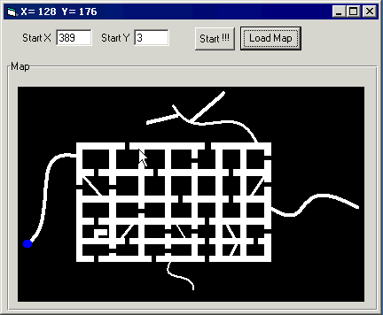



## Robot Simulation \(Using Image Processing\)

### Description

This project is about to find a way to specific location in an Unknown Map. As You know, this is the subject of some robotic games and champions. The map is given in a standard graphic file formats like Bitmaps. Then the program uses a recursive algorithms in the given map to find a way to the destination. The destination is specifies by a BLUE color in the map. Due to the recursive algorithms that is used, if the program can't find the destination, it returns to the starting location. I've include 5 sample maps with the project to better introduce its work. Use coloring like samples (Walls=Black , Way=White , Destination=Blue rgb(0,0,255)) and set the starting point anywhere in the way. In sample maps you don't need to set starting point.
 
### More Info
 

             |
---                |---
**Submitted On**   |2004-10-03 23:34:20
**By**             |[Omid G\.L\.](https://github.com/Planet-Source-Code/PSCIndex/blob/master/ByAuthor/omid-g-l.md)
**Level**          |Advanced
**User Rating**    |4.7 (14 globes from 3 users)
**Compatibility**  |VB 5\.0, VB 6\.0
**Category**       |[Graphics](https://github.com/Planet-Source-Code/PSCIndex/blob/master/ByCategory/graphics__1-46.md)
**World**          |[Visual Basic](https://github.com/Planet-Source-Code/PSCIndex/blob/master/ByWorld/visual-basic.md)
**Archive File**   |[Robot\_Simu1800391042004\.zip](https://github.com/Planet-Source-Code/omid-g-l-robot-simulation-using-image-processing__1-56498/archive/master.zip)

